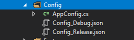

# Use a congif file for Xamarin Forms

Helper que ayuda a usar un archivo de configuración para tus app Xamarin Forms. Soporta diferentes archivos para Debug y Release.

 ===================


ConfigXF for Xamarin.Forms

Install on .Net Standard Library.

## NuGet
* Available on NuGet: [BottomSheetXF](https://www.nuget.org/packages/ConfigXF/)

----------

How use it
-------------

* Crea un archivo de configuración en cualquier sitio de tu proyecto compartido.

* Crea una clase con las propiedades que tiene nuestro archivo de configuración. Puedes usar [quicktype](https://quicktype.io/csharp/) o similar
* Inicializa ConfigXF en App.cs 
```
ConfigManager<AppConfig>.Init(Assembly.GetExecutingAssembly());
```
> - sustituye AppConfig por tu clase creada en el paso anterior
> - puedes pasarle un parametro Newtonsoft.Json.Required para personalizar el comportamiento.
* Usala en cualquier sitio 
```
ConfigManager<AppConfig>.CurrentConfig.YOURPROPERTY
```


## Config files
> - El archivo de configuración debe llamarse:
> - Debug : Config_Debug.json
> - Release : Config_Release.json
> - Override Config : Config.json Remplaza cualquier archivo de configuración anterior
